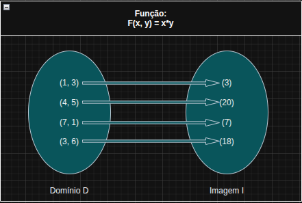

# LMC Multiplication Simulator

This repository contains assembly code written for the [Little Man Computer (LMC)](https://www.101computing.net/lmc/) simulator.  
<<<<<<< HEAD

The program represents the function F(x, y) = x * y. It is defined as a function of two natural variables, mapping ordered pairs from a two-dimensional space to the real line.

The domain is defined as D(f) = N², and the codomain is a natural value resulting from the multiplication of two natural numbers.

Rule of correspondence: The function associates each pair f(x, y) with its product.

## preview

=======
The program functions as a multiplication calculator.       
>>>>>>> 6f89bf9 (Adiciona imagem do fluxograma)
